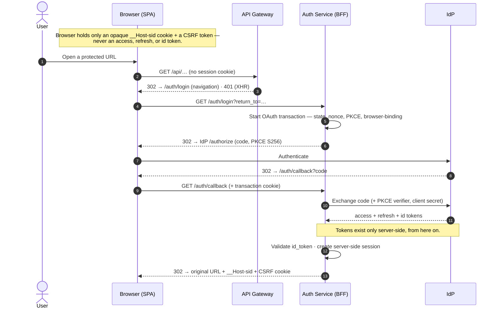
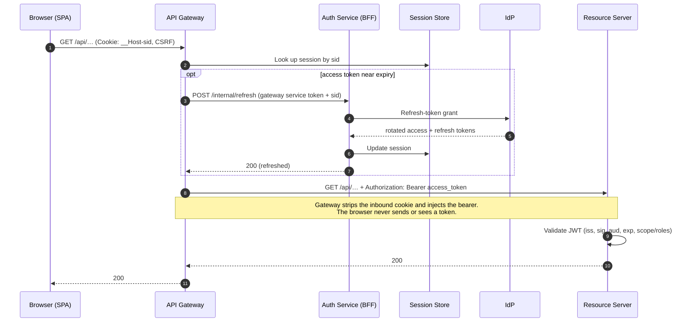
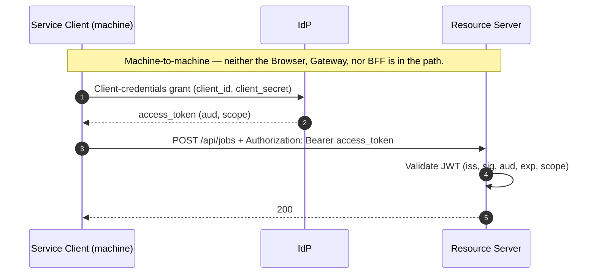

# oidc-reference

Local reference implementation of the Backend-for-Frontend (BFF) session
pattern for OAuth 2.1 and OpenID Connect Core 1.0. The browser holds no
access, refresh, or ID token; the OIDC client role lives in a confidential
server-side service. Session identity is an opaque `HttpOnly` cookie;
tokens live in a Redis-compatible state store keyed by that cookie.

The implementation follows
[RFC 9700](https://datatracker.ietf.org/doc/rfc9700/) (OAuth 2.0 Security
BCP) and OIDC Core §3.1.3.7 for ID-token validation. Two flows are
demonstrated: browser login via Authorization Code + PKCE with
saved-request replay, and service-to-service via Client Credentials.

## Why this shape

**Why BFF and not a public-client SPA running PKCE in the browser.**
Browser PKCE is valid OAuth, but any successful XSS can use or exfiltrate
tokens reachable by JavaScript, browser refresh-token rotation is fragile
in cross-origin policies, and silent iframe renewal is no longer a
dependable browser primitive. A server-side BFF keeps the access /
refresh / ID token off the browser entirely. A token-mediating backend
that still hands access tokens to JavaScript was also rejected for the
same XSS-exfiltration reason.

**Why split BFF into Auth Service + API Gateway, not one combined
service.** Production OIDC deployments at meaningful scale separate the
OAuth surface from the API-gateway surface — different teams (identity
vs. platform), different scaling characteristics (auth is low-frequency
big-payload, API is high-frequency small-payload), different operational
concerns. The "BFF" name historically (Sam Newman, 2015) referred to a
per-frontend API aggregator sitting *after* auth; conflating it with the
OAuth client role obscures both. A combined BFF is also valid; this
reference ships the split because that's the shape production readers
recognize.

**Why a server-side state store, not a framework HTTP-session blob.** The
two pieces of state have different lifetimes and addressing: a short
pre-auth OAuth transaction keyed by `state`, and a longer post-auth
session keyed by `sid`. Keeping them as separate keyspaces (`tx:{state}`
and `sess:{sid}`) means the transaction is keyed by the OAuth `state`
itself — no pre-auth session cookie, and so no session-fixation class to
defend against. Both keyspaces are inspectable, which is the right
property for a reference and for incident response.

**Why standard OAuth/OIDC interfaces, not provider-specific APIs.** All
application code branches on `iss` / `aud` / scopes / claim paths /
endpoints from `.well-known/openid-configuration` — never on the provider
brand. Provider differences live in configuration: `app.roles-claim-path`
for the claim shape, env vars for the issuer and client credentials. Swapping
a provider is a config exercise — issuer, endpoints, audience, scopes, roles,
**and** the internal trust identifiers (gateway/service client ids, internal
refresh audience) are all env knobs with local-Keycloak defaults; nothing
provider-facing is baked into Java or APISIX. The alternate-realm gate
`just e2e-portability` proves the token-shape swap end-to-end; SPEC-0001
Appendix A and `provider-adapters.md` §"Portability scope" enumerate every knob.

## Architecture

| Component | Role |
|---|---|
| `frontend/` | React + TypeScript SPA. Cookie-authenticated. No OIDC client library in the browser. |
| `auth-service/` | Confidential OIDC client (Nimbus `oauth2-oidc-sdk`). Owns `/auth/*`, the OAuth round-trip, session storage, and `/internal/refresh`. |
| `api-gateway/` | APISIX standalone + custom Lua plugin (`bff-session`). Owns `/api/**` allowlist, `sess:{sid}` lookup, bearer injection, signed-CSRF validation, and refresh delegation. |
| `backend-resource-server/` | JWT validation only; never sees session cookies. |
| `authorization-server/` | Keycloak realm + Compose service. |

The vendor choices (Keycloak, APISIX, Valkey) are interchangeable;
SPEC-0001 Appendix A enumerates the files that change to swap each.
For a practical IdP swap checklist, see
[`docs/operations/provider-adapters.md`](docs/operations/provider-adapters.md).
For non-local hardening, see
[`docs/operations/production-hardening.md`](docs/operations/production-hardening.md).

### Login — Authorization Code + PKCE

Login starts when the browser hits a protected `/api/**` URL with no session — the
gateway bounces a top-level navigation to `/auth/login`, or returns `401` to an XHR
so the SPA navigates itself — or from an explicit "Sign in". The Auth Service runs
the OAuth round-trip and returns the browser to the originally requested URL with
the session and CSRF cookies attached.



### Authenticated request — proxy and transparent refresh

Every `/api/**` call carries only the opaque session cookie. The gateway looks up
the session, transparently refreshes the access token when it is near expiry
(delegating to the Auth Service, which holds the refresh token), then injects a
bearer for the Resource Server.



### Logout — RP-initiated, `id_token_hint` stays server-side


The IdP end-session URL carries `id_token_hint` (PII), so it never reaches SPA
JavaScript: the Auth Service hands back a same-origin, single-use handle and emits
the IdP redirect itself from `/auth/logout/continue`.

Wire-level detail — exact cookie attributes, TTLs, validation rules, and the
`/internal/refresh`, `sess:{sid}`, and signed-CSRF contracts — lives in
[SPEC-0001](docs/specs/SPEC-0001-core-oidc-flows.md).

### Service-to-service — Client Credentials

Machine callers obtain a token directly from the Authorization Server and call the
Resource Server with a bearer. Neither the Auth Service nor the API Gateway is in
the path.



### Session and CSRF cookies

- **Session cookie.** `__Host-sid` with `HttpOnly`, `Secure`,
  `SameSite=Lax`, `Path=/`, no `Domain`. In local HTTP mode the name
  downgrades to `sid` and `Secure` is dropped (browsers reject `__Host-`
  without `Secure`). `SameSite=Lax` is required for the cross-site
  Keycloak → callback redirect; the signed CSRF token provides
  state-change protection.
- **CSRF cookie.** `XSRF-TOKEN` is JS-readable and carries an
  HMAC-SHA256-signed value (`<value>.<hmac>`). The SPA echoes it as
  `X-XSRF-TOKEN` on state-changing requests. Unsigned double-submit is
  rejected: an attacker with a sibling-subdomain `document.cookie` write
  could otherwise forge a matching pair. `SameSite=Strict` (set by the
  signing party) tightens the surface further.
- **Browser-binding cookie.** `oauth_tx` is issued at `/auth/login` with
  `Path=/auth/callback/idp` and `SameSite=Lax`. Its HMAC is stored in
  `tx:{state}`; the callback rejects when the supplied cookie's HMAC
  doesn't match (defends against an attacker who exfiltrates `(code,
  state)` but is in a different user-agent).

## Security controls

| Control | Reference | Where |
|---|---|---|
| Authorization Code + PKCE S256 | OIDC Core §3.1.2 | `auth-service` |
| `state`, `nonce`, ID-token signature/iss/aud/exp | OIDC Core §3.1.3 | `JwtOidcIdTokenValidator` |
| `at_hash` when present | OIDC Core §3.1.3.7 step 7 | `JwtOidcIdTokenValidator` |
| `iss` query-param mix-up defense | [RFC 9207](https://datatracker.ietf.org/doc/rfc9207/) | `AuthController#callback` |
| Refresh rejected by the AS (`invalid_grant`) → 409 + session invalidation; realm still enables rotation + reuse detection | [RFC 9700 §4.14](https://datatracker.ietf.org/doc/rfc9700/) | `AuthorizationCodeTokenRefreshClient` + realm |
| Signed double-submit CSRF (HMAC-SHA256, base64url) | — | `SignedCsrfSupport`, `bff-session.lua` |
| `oauth_tx` browser-binding cookie | — | `OAuthTxBinding` |
| RP-initiated logout with `id_token_hint` | OIDC RP-Initiated Logout 1.0 | `AuthController#logout` |
| `redirect_uri` pinned via `app.base-url` (defeats Host-header injection) | — | `AuthController#baseUrl` |
| Per-session refresh lock (Java); `lua-resty-lock` around CC-token fetch (Lua) | — | `InternalRefreshController`, `bff-session.lua` |
| Rate-limit on `/auth/login` + `/auth/callback/idp` (APISIX `limit-req`) | — | `apisix.yaml.template` |
| Boot-time sentinel guard refusing default dev secrets in `prod` profile | — | `SecretSentinelValidator` (Java), `bff-session.lua` |

## What's deliberately not here

For a reference repo, what isn't shipped is part of the contract. Each
non-adoption below has a reconsideration trigger; the full rationale lives
in [`docs/architecture/architecture-decisions.md`](docs/architecture/architecture-decisions.md)
§F.

- **Sender-constrained tokens (DPoP / mTLS).** The BFF pattern removes the
  primary browser-token leakage vector, and the RS sits behind the API
  Gateway. Reconsider when the RS is exposed to multi-tenant or untrusted
  callers.
- **Asymmetric client authentication (`private_key_jwt`, mTLS to the AS).**
  Shared-secret client auth is sufficient for the teaching baseline.
  Reconsider for FAPI / PSD2 or any compliance regime that mandates it.
- **JAR, PAR, RAR.** Exact redirect-URI matching + PKCE + state + nonce
  cover the demonstrated flow; scopes cover the authorization model.
  Reconsider for multiple authorization servers, untrusted-network
  authorization request handling, or structured per-resource grants.
- **OIDC Front-Channel Logout.** RP-initiated logout covers user-driven
  logout, and OIDC Back-Channel Logout (implemented; `POST
  /backchannel-logout`) covers IdP-driven revocation. The browser-iframe
  front-channel variant is not added.
- **OIDC Session Management.** The cookie-based BFF has no browser↔AS
  session to monitor; session changes surface via `/auth/me` polling or the
  next `/api/**` returning 401.
- **Encrypted-at-rest sessions in Valkey.** Local Valkey runs without
  AUTH/TLS/encryption. Reconsider before any non-local deployment alongside
  state-store AUTH, TLS, and network isolation.
- **Distributed refresh lock.** The Auth Service uses an in-process
  `ReentrantLock` keyed by `sid`. Clustered deployments need a state-store
  `SET NX EX` equivalent.

## Stack

- React 19 + TypeScript, Vite
- Java 25 + Spring Boot 4 (Auth Service, Resource Server)
- Nimbus `oauth2-oidc-sdk` for OIDC discovery, JWKS, ID-token validation,
  PKCE
- Spring Security 7 (JWT decoder, validator composition)
- Apache APISIX 3.16 standalone + custom Lua plugin
  (`lua-resty-http`, `lua-resty-lock`)
- Keycloak 26 (embedded H2 via `KC_DB=dev-file`; no separate database)
- Valkey 9 (Redis-compatible state store)
- Docker Compose

## Run locally

Prerequisites: Docker Desktop or equivalent and Node 20+. Java 25 is needed
only when running the Spring modules directly or their unit tests outside
Docker.

Keycloak, Valkey, APISIX, Auth Service, and Resource Server run in Compose.
The SPA runs on the host through Vite for the frontend inner loop.

```sh
# 1. Bring the reference stack up.
just up

# 2. Start the SPA dev server.
cd frontend && npm install && npm run dev
```

- SPA: <http://127.0.0.1:5173/> — sign in as `alice` / `alice`.
- Keycloak admin console: <http://localhost:8080/> — sign in as
  `admin` / `admin` to inspect the seeded realm.

Verification:

```sh
just e2e-auth                            # canonical authenticated proof: login → API → refresh delegation → logout
./scripts/verify-all.sh                  # per-component checks + secret scan
RUN_FULL_STACK_AUTH=1 ./scripts/verify-all.sh   # also brings the stack up and runs the gateway suite
```

`just e2e-auth` is the canonical authenticated local proof. It brings the stack
up, runs `frontend/tests/e2e/reference-flow.spec.ts` for the real browser flow,
then runs the gateway refresh-delegation proof with a real login-derived
`sess:{sid}`. It covers Keycloak login, `/auth/me`, authenticated `/api/**`,
role enforcement, refresh delegation, and RP-initiated logout through the
same-origin `/auth/logout/continue` handle.

## Documentation

- [`docs/specs/SPEC-0001-core-oidc-flows.md`](docs/specs/SPEC-0001-core-oidc-flows.md)
  — the build contract. Wire formats for `sess:{sid}`, `tx:{state}`,
  `/internal/refresh`, signed CSRF; threat model; trust boundaries.
  Appendix A is the vendor-swap matrix.
- [`docs/architecture/architecture-decisions.md`](docs/architecture/architecture-decisions.md)
  — rationale + rejected alternatives.
- [`SECURITY.md`](SECURITY.md) — threat model, crypto primitives, key
  handling, audit-logging surface, production-hardening list,
  vulnerability reporting.
- [`OIDC-compliance.md`](OIDC-compliance.md) — conformance matrix against
  OpenID Connect Core 1.0 + Discovery + RP-Initiated Logout.
- [`RFC9700-compliance.md`](RFC9700-compliance.md) — control-by-control
  status against RFC 9700 (OAuth 2.0 Security BCP, also OAuth 2.1 baseline).
- [`docs/operations/provider-adapters.md`](docs/operations/provider-adapters.md) — IdP swap walkthrough
  (Keycloak / Auth0 / Okta / Entra).
- [`AGENTS.md`](AGENTS.md) — contributor operating contract.
