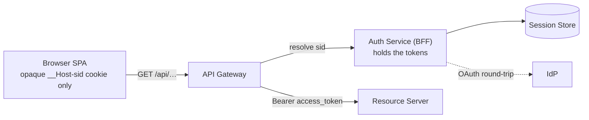
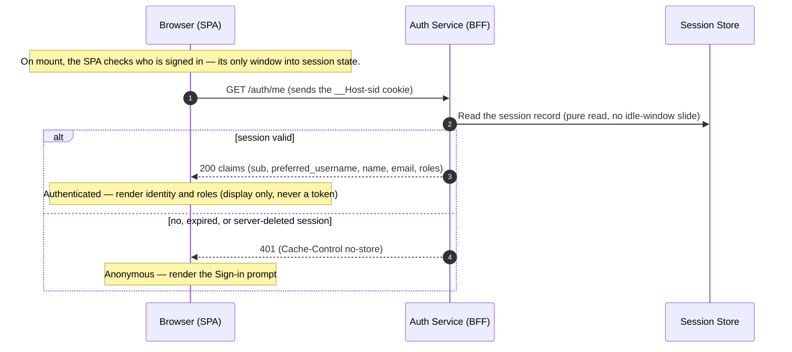
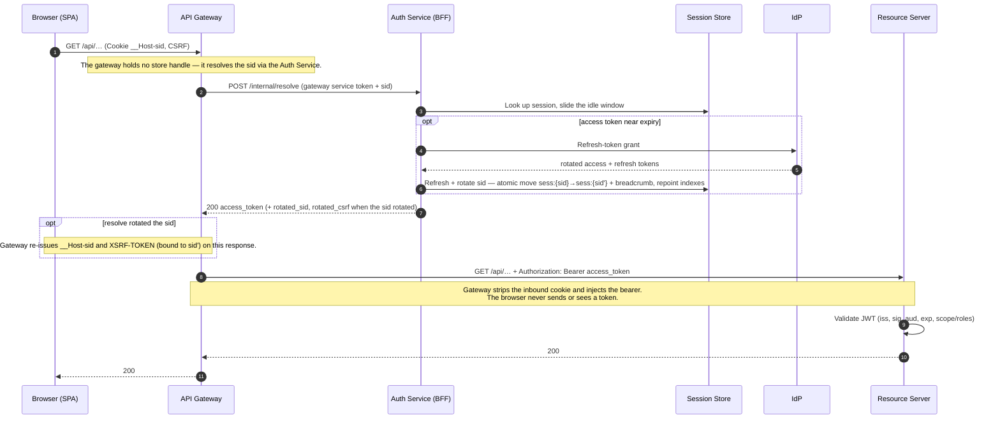
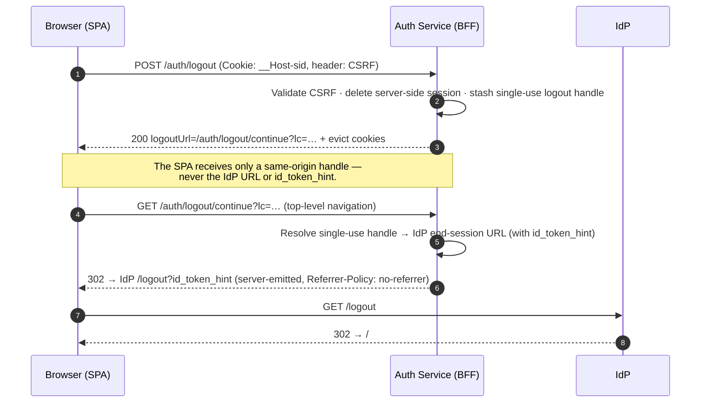
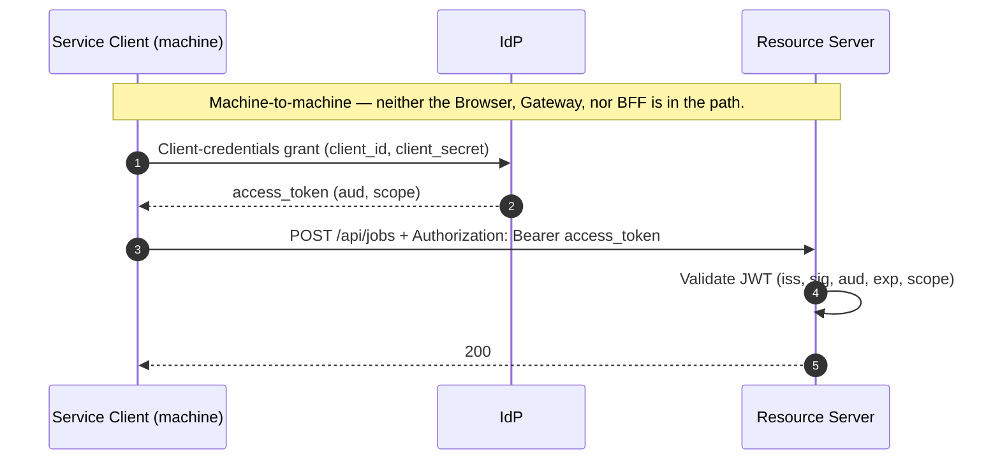

# oidc-reference

A complete, **runnable** reference for the Backend-for-Frontend (BFF) session pattern: browser-app OAuth 2.1 and OpenID Connect Core 1.0 with **no tokens in the browser** — and a live test that fails if one ever leaks.

[](LICENSE)


> **The claim that matters:** the browser holds only an opaque `HttpOnly` session cookie. Access, refresh, and ID tokens live server-side, in a Redis-compatible store. An end-to-end test inspects the browser's storage and cookies and **asserts that no token reaches browser JavaScript**.

---

## 30-second tour

1. **The browser holds no tokens and runs no OIDC library** — just an opaque `__Host-sid` cookie and a CSRF token.
2. **A confidential server-side BFF owns the OAuth client role**, split into a dedicated **Auth Service** (the OIDC client) and an **API Gateway** (routing + bearer injection).
3. **Every `/api/**` call is the phantom-token pattern:** the gateway swaps the opaque cookie for a real access token (resolved by the Auth Service) and injects it as the `Bearer` proxied to the Resource Server.



If you read nothing else, run `just up` and then `just e2e-auth` — login → API call → token refresh → logout, end to end.

---

## Why this pattern

Most OIDC walkthroughs hand the SPA a public client running PKCE in the browser. That puts the access token where any XSS payload can read it. This reference demonstrates the secure default instead and proves it holds:

| Decision | This reference | Common alternative |
| --- | --- | --- |
| Where tokens live | Server-side BFF; access, refresh, and ID tokens never reach the browser | A public-client SPA running PKCE in the browser (tokens are XSS-reachable), or a backend that still hands the access token to JavaScript |
| Component shape | Split Auth Service (the OAuth/OIDC client) + API Gateway (routing, bearer injection) | One combined service — valid, but mixes the OAuth-client and API-gateway roles |
| Session state | Two server-side keyspaces, `tx:{state}` (pre-auth, keyed by the OAuth `state`) and `sess:{sid}` (post-auth); no pre-auth session cookie, so no session-fixation class | A framework HTTP-session blob |
| Provider coupling | Branch on `iss` / `aud` / scopes / claim paths from `.well-known/openid-configuration`; differences live in config | Provider-specific APIs baked into Java or the gateway |

It implements [RFC 9700](https://datatracker.ietf.org/doc/rfc9700/) (OAuth 2.0 Security BCP, also the OAuth 2.1 baseline) and OIDC Core §3.1.3.7 for ID-token validation, across two flows: **browser login** (Authorization Code + PKCE with saved-request replay) and **service-to-service** (Client Credentials).

Full rationale and reconsideration triggers live in [`docs/architecture/architecture-decisions.md`](docs/architecture/architecture-decisions.md).

---

## What's included

- **A live test asserts no token reaches the browser.** The `id_token` never reaches browser JS, storage, SPA-readable JSON, SPA-visible cookies, or app logs; only the server's `/auth/logout/continue` → IdP redirect carries `id_token_hint`, and the test confirms it by inspecting the browser.
- **Each control is linked to its spec, code, and test.** The [Security controls](#security-controls) table maps each control to its RFC/OIDC section, the code that implements it, and the gate that proves it.
- **Identity Providers are swappable by configuration.** The code carries no provider-specific behavior — it branches on standard OIDC values from discovery. `just e2e-portability` runs the same code against a second realm whose tokens carry a different shape.

---

## Architecture

| Component | Role |
| --- | --- |
| `frontend/` | React + TypeScript SPA. Cookie-authenticated. **No OIDC client library in the browser.** |
| `auth-service/` | Confidential OIDC client (Nimbus `oauth2-oidc-sdk`). Owns `/auth/*`, the OAuth round-trip, session storage, and `/internal/resolve`. |
| `api-gateway/` | APISIX standalone + custom Lua plugin (`bff-session`). Owns the `/api/**` allowlist, sid resolution via `/internal/resolve` (holds **no** session-store handle), bearer injection, and signed-CSRF validation. |
| `backend-resource-server/` | JWT validation only; never sees session cookies. |
| `authorization-server/` | Keycloak realm + Compose service. |

The vendor choices — Keycloak, APISIX, Valkey — are interchangeable. Appendix A of [SPEC-0001](docs/specs/SPEC-0001-core-oidc-flows.md) is the vendor-swap matrix.

<details>
<summary><strong>Flow 1 — Login (Authorization Code + PKCE)</strong></summary>

Login starts when the browser hits a protected `/api/**` URL with no session, or when the user clicks "Sign in". On the no-session `/api/**` case:

- top-level navigation → `302` to `/auth/login`;
- XHR → `401`, and the SPA navigates itself.

The Auth Service then runs the OAuth round-trip and returns the browser to the originally requested URL with the session and CSRF cookies set.


</details>

<details>
<summary><strong>Flow 2 — Identity check (<code>/auth/me</code>)</strong></summary>

The SPA holds no session state of its own. It calls `/auth/me` to learn whether a session exists and who the user is. `/auth/me` is a pure read — it never extends the session and never returns a token.



</details>

<details>
<summary><strong>Flow 3 — Authenticated request (phantom token + transparent refresh)</strong></summary>

Every `/api/**` call carries only the opaque session cookie — the phantom-token pattern, where only the Auth Service touches the session store (see [`docs/architecture/phantom-token-session-resolution.md`](docs/architecture/phantom-token-session-resolution.md)):

- The gateway resolves the sid via `/internal/resolve` (Client Credentials over an internal RPC).
- The Auth Service slides the idle window and refreshes the access token if near expiry.
- The gateway injects the returned token as a bearer for the Resource Server.



</details>

<details>
<summary><strong>Flow 4 — Logout (RP-initiated, <code>id_token_hint</code> stays server-side)</strong></summary>

The IdP end-session URL carries `id_token_hint` (PII), so it never reaches SPA JavaScript. The Auth Service hands back a same-origin, single-use handle and emits the IdP redirect itself from `/auth/logout/continue`.



</details>

<details>
<summary><strong>Flow 5 — Service-to-service (Client Credentials)</strong></summary>

Machine callers obtain a token directly from the Authorization Server and call the Resource Server with a bearer. Neither the Auth Service nor the API Gateway is in the path.



</details>

Wire-level detail — exact cookie attributes, TTLs, validation rules, and the `/internal/resolve`, `sess:{sid}`, and signed-CSRF contracts — lives in [SPEC-0001](docs/specs/SPEC-0001-core-oidc-flows.md).

---

## Cookies

This reference uses four cookies, each with a deliberate scope and `SameSite` value:

| Cookie | Readable by JS? | `SameSite` | Why |
| --- | --- | --- | --- |
| `__Host-sid` | No (`HttpOnly`) | `Lax` | The only credential. `Lax` is **required** so the cross-site Keycloak → `/auth/callback` redirect still sends it; the signed CSRF token supplies the state-change protection `Lax` alone wouldn't. |
| `XSRF-TOKEN` | Yes | `Strict` | Carries an HMAC-SHA256-signed value (`<value>.<hmac>`, bound to the `sid`). The SPA echoes it as `X-XSRF-TOKEN`. **Strict** because, unlike the session cookie, it's never needed on the cross-site callback. |
| `oauth_tx` | No (`HttpOnly`) | `Lax` | Browser-binding cookie issued at `/auth/login`, scoped to `Path=/auth/callback/idp`. Its HMAC is stored in `tx:{state}`; the callback rejects a mismatch — defeating an attacker who exfiltrates `(code, state)` from a different user-agent. |

Two finer points worth calling out:

- **Why signed double-submit.** An attacker with a sibling-subdomain `document.cookie` write could forge a matching unsigned pair. The HMAC (bound to the `sid`) makes a forged pair fail validation, so unsigned double-submit is rejected outright.
- **Sid rotation on refresh (control A6).** A token refresh rotates the `sid`: the Auth Service atomically moves `sess:{sid}` → `sess:{sid'}` and leaves a short-lived `rotated:{sid}` breadcrumb so a request in flight on the old sid follows it rather than losing the session. `/internal/resolve` returns `rotated_sid`, `rotated_sid_max_age`, and `rotated_csrf`, and the gateway re-issues both the `__Host-sid` and the HMAC-bound `XSRF-TOKEN`. This bounds a once-observed sid to a single refresh cycle, not the session lifetime ([SECURITY](SECURITY.md) S-5). Breadcrumb and logout-race mechanics are in [SPEC-0001](docs/specs/SPEC-0001-core-oidc-flows.md).

> **Local-mode note.** Over plain HTTP the session cookie name downgrades to `sid` and `Secure` is dropped, because browsers reject the `__Host-` prefix without `Secure`. This is a local-only concession; see [production hardening](docs/operations/production-hardening.md).

---

## Security controls

Each control maps to its reference and the code that implements it.

| Control | Reference | Where |
| --- | --- | --- |
| Authorization Code + PKCE S256 | OIDC Core §3.1.2 | `auth-service` |
| `state`, `nonce`, ID-token signature/iss/aud/exp | OIDC Core §3.1.3 | `JwtOidcIdTokenValidator` |
| `at_hash` when present | OIDC Core §3.1.3.7 step 7 | `JwtOidcIdTokenValidator` |
| `iss` query-param mix-up defense | [RFC 9207](https://datatracker.ietf.org/doc/rfc9207/) | `AuthController#callback` |
| Refresh rejected by AS (`invalid_grant`) → 409 + session invalidation; realm enables rotation + reuse detection | [RFC 9700 §4.14](https://datatracker.ietf.org/doc/rfc9700/) | `AuthorizationCodeTokenRefreshClient` + realm |
| Signed double-submit CSRF (HMAC-SHA256, base64url) | — | `SignedCsrfSupport`, `bff-session.lua` |
| `oauth_tx` browser-binding cookie | — | `OAuthTxBinding` |
| RP-initiated logout with `id_token_hint` | OIDC RP-Initiated Logout 1.0 | `AuthController#logout` |
| Step-up: `auth_time` recency **and** `acr` assurance gates on a sensitive route | OIDC Core §3.1.2.1, [RFC 9470](https://datatracker.ietf.org/doc/rfc9470/) | RS `ApiController#admin`, `AuthController#stepUp`, realm `auth_time` + `acr` mappers |
| `redirect_uri` pinned via `app.base-url` (defeats Host-header injection) | — | `AuthController#baseUrl` |
| Per-session refresh lock (in-process default, distributed opt-in) | — | `RefreshLock`, `InProcessRefreshLock`, `DistributedRefreshKeyLock`, `RefreshLockConfig`, `bff-session.lua` |
| Sid rotation on refresh — atomic `sess:{sid}`→`sess:{sid'}` move + `rotated:{sid}` breadcrumb so in-flight requests follow it | — | `InternalResolveController` (A6); proven by `reference-flow.spec.ts` story 17 and `e2e-distributed-lock.sh` |
| Rate-limit on `/auth/login` + `/auth/callback/idp` | — | `apisix.yaml.template` |
| Sentinel guard refusing default dev secrets (fail-closed at boot/render) | — | `SecretSentinelValidator`, `render-apisix-config.sh`, `bff-session.lua` |

**`acr` scope (local realm).** A fresh interactive login maps to `acr=1`; remembered-SSO maps to `acr=0`. The gate rejects any `acr` below `app.step-up.required-acr` (default `1`). Note that **`acr=1` is a Level-of-Assurance value, not proof of MFA** — mapping `acr` to a real MFA level is per-IdP config, not done here. See [`RFC9470-compliance.md`](RFC9470-compliance.md).

---

## What's deliberately *not* here

Full rationale in [`docs/architecture/architecture-decisions.md`](docs/architecture/architecture-decisions.md) §F.

- **Sender-constrained tokens (DPoP / mTLS).** RS bearer tokens are not sender-bound, so network isolation of the Resource Server is load-bearing until added ([SECURITY](SECURITY.md) G-8). Reconsider when the RS faces untrusted callers.
- **Asymmetric client authentication (`private_key_jwt`, mTLS to the AS).** Shared-secret auth suffices for the baseline. Reconsider for FAPI / PSD2.
- **JAR, PAR, RAR.** Exact redirect-URI + PKCE + state + nonce cover the flow; scopes cover authorization. Reconsider for multiple ASes or per-resource grants.
- **OIDC Front-Channel Logout.** RP-initiated logout + OIDC Back-Channel Logout (implemented, `POST /backchannel-logout`) cover it; the iframe variant is not.
- **OIDC Session Management.** No browser↔AS session to monitor; state surfaces via `/auth/me` or the next `/api/**` returning 401.
- **Encrypted-at-rest sessions in Valkey.** Local Valkey runs without AUTH/TLS/encryption. Add before any non-local deployment.

---

## Stack

> **Heads-up:** the stack is recent by design — Java 25, Spring Boot 4, Spring Security 7. Exact versions are pinned in `frontend/package.json`, the service `pom.xml` files, and `compose.yaml`.

- React 19 + TypeScript, Vite
- Java 25 + Spring Boot 4 (Auth Service, Resource Server)
- Nimbus `oauth2-oidc-sdk` for OIDC discovery, JWKS, ID-token validation, PKCE
- Spring Security 7 (JWT decoder, validator composition)
- Apache APISIX 3 standalone + custom Lua plugin (`lua-resty-http`, `lua-resty-lock`)
- Keycloak 26 (embedded H2 via `KC_DB=dev-file`; no separate database)
- Valkey 9 (Redis-compatible state store)
- Docker Compose

---

## Run locally

Works on macOS, Linux, and Windows.

**Prerequisites**

- **Docker Desktop** (macOS/Windows) or any Docker-compatible engine such as Podman.
- **Node 20+** for the SPA dev server.
- **A POSIX shell** for `scripts/*.sh`: built in on macOS/Linux; on Windows use WSL2 (recommended) or Git Bash.
- **Java 25** — only needed on the host if you run the Spring modules or their unit tests *outside* Docker (Docker builds the Java images for you).
- **`just` is optional** — it's a command runner; each recipe wraps a script (`just up` runs `sh scripts/up.sh`). Install via `brew install just`, `winget install Casey.Just`, or `scoop install just`.

```bash
# 1. Bring the reference stack up (Keycloak, Valkey, APISIX, Auth Service, Resource Server).
just up                 # or, without just:  sh scripts/up.sh

# 2. Start the SPA dev server.
cd frontend && npm install && npm run dev
```

- **SPA:** <http://127.0.0.1:5173/> — sign in as `alice` / `alice`.
- **Keycloak admin:** <http://localhost:8080/> — `admin` / `admin` to inspect the seeded realm.

**Verify it**

```bash
just e2e-auth                                    # authenticated proof: login → API → refresh → logout
just e2e-portability                             # same code against a second realm (IdP portability)
sh scripts/verify-all.sh                         # per-component checks + secret scan
RUN_FULL_STACK_AUTH=1 sh scripts/verify-all.sh   # the above, plus full stack + gateway suite
```

---

## Terminology

OAuth/OIDC vocabulary, mapped to this repo's components.

| Term | Meaning |
| --- | --- |
| OIDC | OpenID Connect — the identity layer on top of OAuth 2.0. |
| Relying Party (RP) | The app that delegates login to an identity provider. Here, the Auth Service. |
| Authorization Server (AS) | The service that authenticates the user and issues tokens. Here, Keycloak. |
| Identity Provider (IdP) | The Authorization Server in its identity role; used interchangeably here. |
| Resource Server (RS) | The API that validates access tokens and serves data. Here, `backend-resource-server`. |
| BFF | Backend-for-Frontend — the server-side component that holds tokens so the browser never does. |
| `sid` / session cookie | The `sid` is the opaque session identifier; the server keys the record on it (`sess:{sid}`). The browser carries the `sid` in `__Host-sid` — its only credential. The cookie is the envelope; the `sid` is the value inside. |
| PKCE | Proof Key for Code Exchange — binds an authorization code to the client that began the flow. |
| JWT / JWKS | JSON Web Token / JSON Web Key Set (the public keys that verify a JWT signature). |
| CSRF / XSS | Cross-Site Request Forgery / Cross-Site Scripting. |
| SPA | Single-page application — the browser app (here, React). |
| acr / LoA | Authentication Context Class Reference / Level of Assurance — how strongly the user authenticated. |
| SSO | Single sign-on. |

---

## Documentation

- [`docs/specs/SPEC-0001-core-oidc-flows.md`](docs/specs/SPEC-0001-core-oidc-flows.md) — the build contract. Wire formats for `sess:{sid}`, `tx:{state}`, `/internal/resolve`, signed CSRF; threat model; trust boundaries. Appendix A is the vendor-swap matrix.
- [`docs/architecture/architecture-decisions.md`](docs/architecture/architecture-decisions.md) — rationale + rejected alternatives.
- [`SECURITY.md`](SECURITY.md) — threat model, crypto primitives, key handling, audit-logging surface, production-hardening list, vulnerability reporting.
- [`OIDC-compliance.md`](OIDC-compliance.md) — conformance matrix against OpenID Connect Core 1.0 + Discovery + RP-Initiated Logout.
- [`RFC9700-compliance.md`](RFC9700-compliance.md) — control-by-control status against RFC 9700 (OAuth 2.0 Security BCP / OAuth 2.1 baseline).
- [`RFC9470-compliance.md`](RFC9470-compliance.md) — control-by-control status against RFC 9470 (Step-Up Authentication Challenge).
- [`docs/reference/refresh-rotation.md`](docs/reference/refresh-rotation.md) — refresh-token rotation policy and the `app.refresh-require-rotation` knob.
- [`docs/operations/provider-adapters.md`](docs/operations/provider-adapters.md) — IdP swap walkthrough (Keycloak / Auth0 / Okta / Entra).
- [`docs/operations/production-hardening.md`](docs/operations/production-hardening.md) — the gap list between this local reference and a real deployment.
- [`AGENTS.md`](AGENTS.md) — contributor operating contract.

---

## License

[Apache-2.0](LICENSE).
