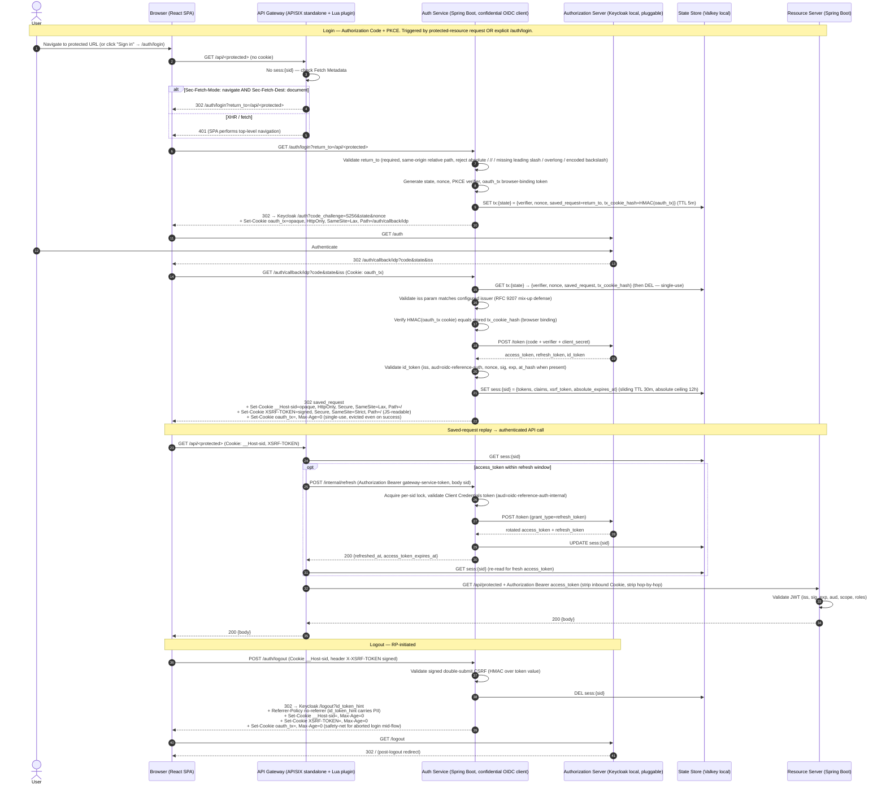
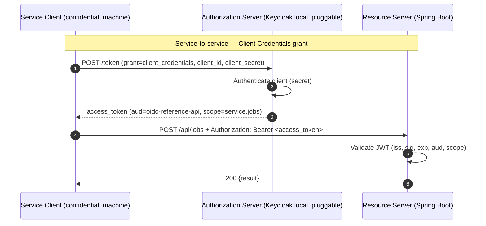

# oidc-reference

Local reference implementation of the Backend-for-Frontend (BFF) session
pattern for OAuth 2.1 and OpenID Connect Core 1.0. The browser holds no
access, refresh, or ID token; the OIDC client role lives in a confidential
server-side service. Session identity is an opaque `HttpOnly` cookie;
tokens live in a Redis-compatible state store keyed by that cookie.

The implementation follows
[RFC 9700](https://datatracker.ietf.org/doc/rfc9700/) (OAuth 2.0 Security
BCP) and OIDC Core §3.1.3.7 for ID-token validation. Two flows are
demonstrated: browser login via Authorization Code + PKCE with
saved-request replay, and service-to-service via Client Credentials.

## Architecture

Five components, split along trust boundaries:

| Component | Role |
|---|---|
| `frontend/` | React + TypeScript SPA. Cookie-authenticated. No OIDC client library in the browser. |
| `auth-service/` | Spring Boot Auth Service. Confidential OIDC client (Nimbus `oauth2-oidc-sdk`). Owns `/auth/*`, the OAuth round-trip, session storage, and `/internal/refresh`. |
| `api-gateway/` | Apache APISIX (standalone) + custom Lua plugin (`bff-session`). Owns `/api/**` allowlist, `sess:{sid}` lookup, bearer injection, signed-CSRF validation, and refresh delegation. |
| `backend-resource-server/` | Spring Boot Resource Server. JWT validation only; never sees session cookies. |
| `authorization-server/` | Keycloak realm + Compose service (the local IdP). |

The vendor choices (Keycloak, APISIX, Valkey) are not load-bearing on the
pattern; SPEC-0001 Appendix A enumerates the files that change to swap
each one.

### Browser flow — Authorization Code + PKCE

Login is triggered either by the browser hitting a protected URL while
unauthenticated, or by an explicit navigation to `/auth/login`. The API
Gateway detects no-session on `/api/**` and, for top-level navigations,
bounces to `/auth/login`. The Auth Service runs the OAuth round-trip and
returns a `302` to the originally-requested URL with the session and CSRF
cookies attached.



A `fetch`/XHR to `/api/*` without a session returns `401`, not a redirect
(XHR cannot render an external login page). The SPA performs the top-level
navigation itself. The gateway distinguishes XHR from document navigation
via `Sec-Fetch-Mode` and `Sec-Fetch-Dest`, with `Accept: text/html` as a
fallback.

### Service flow — Client Credentials

Machine-to-machine callers obtain a token directly from the Authorization
Server and call the Resource Server with a bearer. Neither the Auth
Service nor the API Gateway is in the path.



### Session and CSRF cookies

- **Session cookie.** `__Host-sid` with `HttpOnly`, `Secure`,
  `SameSite=Lax`, `Path=/`, no `Domain`. In local HTTP mode the name
  downgrades to `sid` and `Secure` is dropped (browsers reject `__Host-`
  without `Secure`). `SameSite=Lax` is required for the cross-site
  Keycloak → callback redirect; the signed CSRF token provides
  state-change protection.
- **CSRF cookie.** `XSRF-TOKEN` is JS-readable and carries an
  HMAC-SHA256-signed value (`<value>.<hmac>`). The SPA echoes it as
  `X-XSRF-TOKEN` on state-changing requests. Unsigned double-submit is
  rejected: an attacker with a sibling-subdomain `document.cookie` write
  could otherwise forge a matching pair. `SameSite=Strict` (set by the
  signing party) tightens the surface further.
- **Browser-binding cookie.** `oauth_tx` is issued at `/auth/login` with
  `Path=/auth/callback/idp` and `SameSite=Lax`. Its HMAC is stored in
  `tx:{state}`; the callback rejects when the supplied cookie's HMAC
  doesn't match (defends against an attacker who exfiltrates `(code,
  state)` but is in a different user-agent).

## Security controls

| Control | Reference | Where |
|---|---|---|
| Authorization Code + PKCE S256 | OIDC Core §3.1.2 | `auth-service` |
| `state`, `nonce`, ID-token signature/iss/aud/exp | OIDC Core §3.1.3 | `JwtOidcIdTokenValidator` |
| `at_hash` when present | OIDC Core §3.1.3.7 step 7 | `JwtOidcIdTokenValidator` |
| `iss` query-param mix-up defense | [RFC 9207](https://datatracker.ietf.org/doc/rfc9207/) | `AuthController#callback` |
| Refresh-token rotation + reuse detection → 409 + session invalidation | [RFC 9700 §4.14](https://datatracker.ietf.org/doc/rfc9700/) | `AuthorizationCodeTokenRefreshClient` + realm |
| Signed double-submit CSRF (HMAC-SHA256, base64url) | — | `SignedCsrfSupport`, `bff-session.lua` |
| `oauth_tx` browser-binding cookie | — | `OAuthTxBinding` |
| RP-initiated logout with `id_token_hint` | OIDC RP-Initiated Logout 1.0 | `AuthController#logout` |
| `redirect_uri` pinned via `app.base-url` (defeats Host-header injection) | — | `AuthController#baseUrl` |
| Per-session refresh lock (Java); `lua-resty-lock` around CC-token fetch (Lua) | — | `InternalRefreshController`, `bff-session.lua` |
| Rate-limit on `/auth/login` + `/auth/callback/idp` (APISIX `limit-req`) | — | `apisix.yaml.template` |
| Boot-time sentinel guard refusing default dev secrets in `prod` profile | — | `SecretSentinelValidator` (Java), `bff-session.lua` |

## Stack

- React 18 + TypeScript, Vite
- Java 25 + Spring Boot 4 (Auth Service, Resource Server)
- Nimbus `oauth2-oidc-sdk` for OIDC discovery, JWKS, ID-token validation,
  PKCE
- Spring Security 7 (JWT decoder, validator composition)
- Apache APISIX 3.x (standalone mode) + custom Lua plugin (OpenResty +
  `resty.http`, `resty.lock`)
- Keycloak 26 (local IdP)
- Valkey 9 (Redis-compatible state store)
- Docker Compose for the local stack

## Run locally

The Auth Service and Resource Server run on the host for fast inner-loop
iteration; everything else runs in Compose.

```sh
# 1. Render the APISIX route file with required env vars.
CSRF_SIGNING_KEY=AAAAAAAAAAAAAAAAAAAAAAAAAAAAAAAAAAAAAAAAAAA= \
GATEWAY_CLIENT_SECRET=LOCAL_DEV_GATEWAY_CLIENT_SECRET__CHANGE_BEFORE_DEPLOY \
  ./scripts/render-apisix-config.sh

# 2. Bring up Keycloak, Valkey, APISIX.
docker compose up -d

# 3. In separate shells: Auth Service, Resource Server, SPA.
(cd auth-service && ./mvnw spring-boot:run)
(cd backend-resource-server && ./mvnw spring-boot:run)
(cd frontend && npm install && npm run dev)
```

Browser entry: <http://127.0.0.1:5173/>. Sign in as `alice` / `alice` (the
realm seed).

End-to-end verification:

```sh
./scripts/verify-all.sh          # unit + integration + gateway smoke
```

## Documentation

- [`docs/specs/SPEC-0001-core-oidc-flows.md`](docs/specs/SPEC-0001-core-oidc-flows.md)
  — build contract. Includes Appendix A: vendor-surface analysis (what
  changes to swap IdP / gateway / state store).
- [`docs/architecture/overview.md`](docs/architecture/overview.md) —
  architecture orientation.
- [`docs/architecture/architecture-decisions.md`](docs/architecture/architecture-decisions.md)
  — design rationale and rejected alternatives.
- [`docs/goals/`](docs/goals/) — per-component goals (frontend, RS,
  authorization server, Auth Service, API Gateway).
- [`RFC9700-compliance.md`](RFC9700-compliance.md) — control-by-control
  status against RFC 9700.
- [`PROVIDER-ADAPTERS.md`](PROVIDER-ADAPTERS.md) — claim-shape matrix for
  swapping the IdP (Keycloak, Auth0, Okta, Entra).
- [`AGENTS.md`](AGENTS.md) — contributor operating contract.
