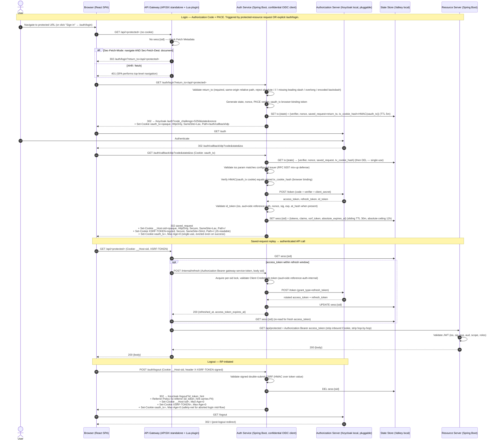
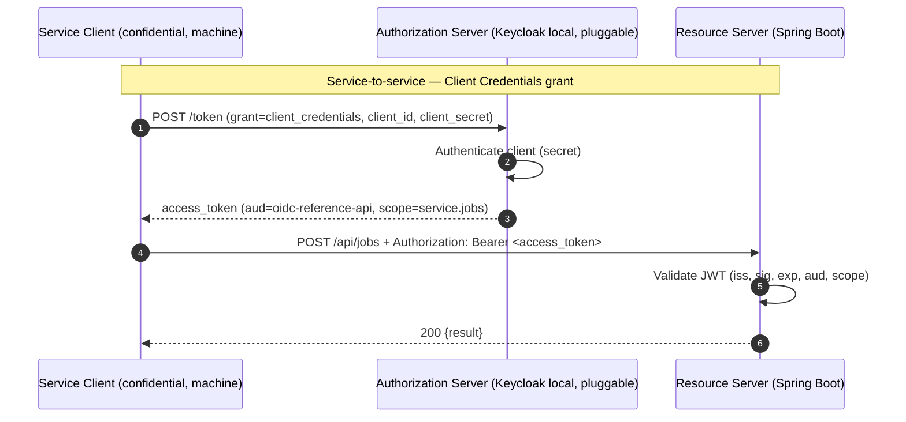

# OIDC Reference

World-class local OAuth 2.1 and OpenID Connect reference project.

This repository is intentionally spec-first. Implementation work should begin by
reading `AGENTS.md`, then the documents under `docs/`.

## Architecture

The browser never holds an access, refresh, or ID token. The BFF session
pattern is implemented as two cooperating services — a dedicated **Auth
Service** (the confidential OAuth/OIDC client, owner of `/auth/*`) and a
dedicated **API Gateway** (owner of `/api/**`, bearer-injection and
allowlist enforcement) — fronted by a single ingress. Tokens live in a
Redis-compatible server-side state store (Valkey locally) and are addressed
by an opaque, `HttpOnly` session cookie. Two flows are demonstrated:
browser user login (saved-request + PKCE) and service-to-service (Client
Credentials).

### Browser flow — Authorization Code + PKCE (split BFF; saved-request replay)

Login is triggered either **implicitly** (the browser hits any protected
URL while unauthenticated) or **explicitly** (the user clicks a Sign in
link that navigates to `/auth/login`). The API Gateway detects no-session
on `/api/**` and (for top-level navigation) bounces to `/auth/login`. The
Auth Service runs the OAuth round-trip, then issues a direct `302` to the
saved request URL with the session and CSRF cookies attached.

**XHR vs top-level navigation.** When a `fetch`/XHR to `/api/*` arrives
without a session, the API Gateway returns `401` (not a redirect — XHR
cannot render the AS login page). The SPA reacts by performing a top-level
navigation to `/auth/login` or to the originally-intended URL, which
triggers the saved-request flow above. The implicit saved-request dance
is reserved for top-level document navigations. The API Gateway distinguishes
the two using Fetch Metadata (`Sec-Fetch-Mode: navigate`,
`Sec-Fetch-Dest: document`) and uses `Accept: text/html` only as a
fallback; fetch/API requests fail fast.

### Service flow — Client Credentials (no Auth Service or API Gateway in path)

Machine-to-machine clients obtain a token directly from the
Authorization Server and call the Resource Server with a bearer token.
Neither the Auth Service nor the API Gateway is involved.

### Cookie attributes are the production contract

The diagrams are the production contract. The session cookie is `__Host-sid`
with `HttpOnly`, `Secure`, `SameSite=Lax`, `Path=/`, no `Domain`. In local
HTTP mode the cookie name downgrades to `sid` and `Secure` is dropped
(browsers reject `__Host-` without `Secure`). The CSRF cookie (`XSRF-TOKEN`)
is a JS-readable, **signed** token (HMAC over the value, or session-bound)
that the SPA echoes as the `X-XSRF-TOKEN` header on state-changing requests.
Naive unsigned double-submit is rejected — see decision B4.

## Current Status

The project is in specification and architecture setup.

Start here:

- `AGENTS.md`
- `docs/README.md`
- `docs/specs/SPEC-0001-core-oidc-flows.md`
- `RFC9700-compliance.md`
- `tasks/backlog.md`

## Intended Stack

- React + TypeScript SPA (no in-browser OIDC client).
- Java 25 + Spring Boot 4.1.0-RC1 Auth Service (OAuth/OIDC confidential
  client, Nimbus oauth2-oidc-sdk direct).
- Apache APISIX standalone mode API Gateway, with a custom Lua plugin for
  BFF session lookup, bearer injection, signed CSRF validation, and
  refresh delegation to the Auth Service.
- Redis-compatible server-side state store for session and PKCE-transaction
  storage; Valkey is the local reference implementation.
- Java 25 + Spring Boot 4.1.0-RC1 Resource Server (JWT validation).
- Keycloak local Authorization Server / Identity Provider.
- Docker Compose local infrastructure.
- No cloud dependencies.
